# KungfuAthlete

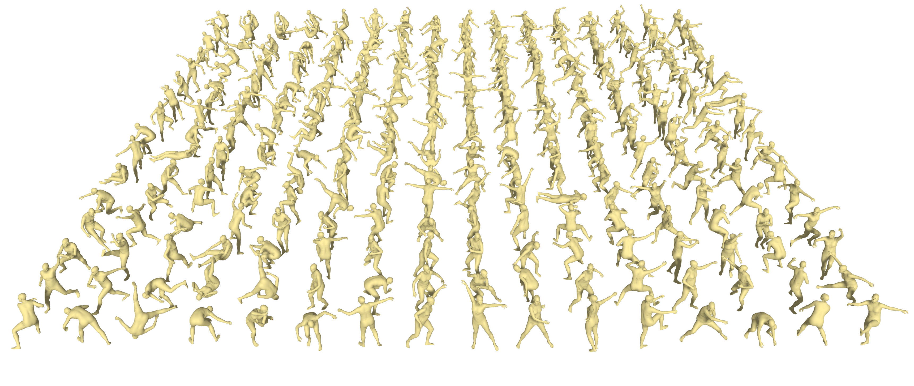</img>


[](https://arxiv.org/abs/2602.13656)
&nbsp;
[](https://youtu.be/8v2pAaRQcPw)
&nbsp;
[](https://www.bilibili.com/video/BV1xJZCBrE4d/)
&nbsp;
[](https://drive.google.com/drive/folders/1ZntW9jPA-BXxttvCWlKQsSbmXt91fSsh?usp=sharing)


## Dataset Overview

The dataset originates from athletes’ **daily martial arts training videos**, totaling **197 video clips**.
Each clip may consist of multiple merged segments. We apply **automatic temporal segmentation**, resulting in **1,726 sub-clips**, ensuring that most segments avoid abrupt transitions that could introduce excessive motion discontinuities.

All sub-clips are processed using **GVHMR** for motion capture, followed by **GMR-based reorientation**.
After filtering and post-processing, the final dataset contains **848 motion samples**, primarily reflecting routine training activities.

Due to substantial noise in the source videos, the dataset has undergone multiple rounds of manual screening and meticulous per-sample refinement. While minor imperfections may still remain in certain samples, we ensure that the vast majority satisfy the requirements for reliable motion tracking.

> **Project Status: Active Development with Ready Ground Subset**
> Model training is currently under active development.
> The **Ground** subset of the dataset is largely complete and ready for training.
> The **Jump** subset still has minor imperfections due to video source limitations. Most samples have been carefully screened, though training performance may vary.
> Your feedback and suggestions are greatly appreciated.


## Category Distribution

| Category       | Count  | Example Subcategories                                |
| -------------- | ------ | ---------------------------------------------------- |
| Daily Training | 715    | –                                                    |
| Fist           | 53     | Long Fist (33), Tai Chi Fist (14), Southern Fist (6) |
| Staff          | 30     | Staff Technique (30)                                 |
| Skills         | 28     | Backflip (12), Lotus Swing (9)                       |
| Saber / Sword  | 15 / 7 | Southern Saber (15), Tai Chi Sword (7)               |

### Notes

* **Daily Training** dominates the dataset (**715 samples, ~84%**), mainly representing standard practice routines rather than explicit technique demonstrations.
* **Boxing techniques** form the largest specialized category, with **Changquan (Long Fist)** being the most prevalent.
* **Skill-based movements** concentrate on high-difficulty acrobatics such as somersaults and lotus swings.
* Weapon-based motions are limited and do not include weapon parts or hand movements (subject to future updates).

---

## Motion Statistics Comparison

All metrics are averaged over the entire dataset.

| Dataset                    | Joint Vel. | Body Lin. Vel. | Body Ang. Vel. | Average Frames   |
| -------------------------- | ---------- | -------------- | -------------- | -------- |
| LAFAN1                     | 0.00142    | 0.00021        | 0.01147        | 10749.23 |
| PHUMA                      | 0.00120    | 0.00440        | -0.00131       | 169.59   |
| AMASS                      | 0.00048    | -0.00568       | 0.00903        | 370.65   |
| **KungFuAthlete (Ground)** | -0.00199   | 0.01057        | 0.04034        | 577.68   |
| **KungFuAthlete (Jump)**   | 0.02384    | 0.05297        | 0.18017        | 397.21   |

---

## Ground vs. Jump Subsets

We divide the dataset based on the presence of jumping motions:

* **KungFuAthlete (Ground)**
  Contains non-jumping actions, emphasizing:

  * Continuous ground-based power generation
  * Rapid body rotations
  * Weapon manipulation and stance transitions

* **KungFuAthlete (Jump)**
  Includes high-dynamic aerial motions such as:

  * Somersaults
  * Cartwheels
  * Other acrobatic jumps

### Key Observations

* The **Jump subset** exhibits the **highest joint velocity, body linear velocity, and angular velocity** among all compared datasets.
* The **Ground subset**, while excluding jumps, still shows significantly higher dynamics than natural motion datasets (e.g., LAFAN1, AMASS).
* Compared to PHUMA and AMASS, which focus on daily activities and walking motions, **KungFuAthlete demonstrates stronger non-stationarity, larger motion amplitudes, and more challenging transient dynamics**, even at comparable or higher frame rates.

### ⚠️ Safety Warning

> The *Jump* subset is intended for studying the upper limits of humanoid motion. Direct training or deployment on real robots without strict safety constraints may lead to serious hardware damage.

## Demo

<table>
<tr>
<td align="center" width="50%">

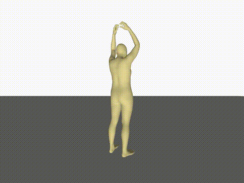  
**278 GVMR SMPL**

</td>
<td align="center" width="50%">

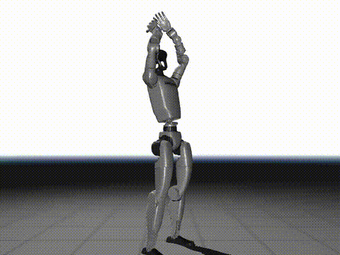  
**278 GMR, Height-Adjusted**

</td>
</tr>
</table>

## Pipeline

KungfuAthlete's data pipeline: 

```
[Video] → Cut by scene → GVHMR → [GVHMR-Pred (smplh)] → GMR → [Robot Motion (qpos)] → Artificial Selection → Height-Adjusted → [KungfuAthlete]
```

### Supported Robots

| Robot | ID | DOF |
|-------|-----|-----|
| Unitree G1 | `unitree_g1` | 29 |

See [GMR README](https://github.com/YanjieZe/GMR) for other list


## Data Format

### GVHMR pred

```python
# gvhmr_pred.pt
{
  "smpl_params_global":
  {
    "body_pose": torch.Tensor,    # (N, 63)
    "betas": torch.Tensor,    # (N, 10)
    "global_orient": torch.Tensor,    # (N, 3)
    "transl": torch.Tensor,    # (N, 3)
  }
  "smpl_params_incam":
  ...
}
```

If you intend to perform motion retargeting to other robotic platforms, or to employ alternative retargeting methodologies, please use the SMPL-H files provided in the  `collection_gvhmr` directory.

### GMR qpos (`org_smoothed/`)

```python
# robot_qpos.npz
{
  "fps": array(30),
  "qpos": np.ndarray,    # (N, 36) 36 = 3(position xyz) + 4(quaternion wxyz) + 29(DOF)
}
```


### For Holosoma or BeyondMimic (`org_smoothed_mj/`)

All motion files under `org_smoothed_mj/` are stored in NumPy `.npz` format and contain time-sequential kinematic data for Unitree G1 training. Each file represents a single motion clip sampled at `fps` Hz and includes joint-level states and rigid-body states expressed in the **world coordinate frame** (quaternion format: xyzw; units: meters, radians, m/s, rad/s).

```python
motion_clip = {
    "fps": np.array([50]),               # Frame rate (Hz)
    "joint_pos": np.ndarray,             # Shape (T, 36), joint DoF positions (rad)
    "joint_vel": np.ndarray,             # Shape (T, 35), joint angular velocities (rad/s)
    "body_pos_w": np.ndarray,            # Shape (T, 53, 3), rigid body positions in world frame (m)
    "body_quat_w": np.ndarray,           # Shape (T, 53, 4), rigid body orientations in world frame (xyzw)
    "body_lin_vel_w": np.ndarray,        # Shape (T, 53, 3), rigid body linear velocities (m/s)
    "body_ang_vel_w": np.ndarray,        # Shape (T, 53, 3), rigid body angular velocities (rad/s)
    "joint_names": np.ndarray,           # Shape (29,), controllable joint names (ordered)
    "body_names": np.ndarray,            # Shape (53,), rigid body names (ordered, includes head_link)
}
```

Here, `T` denotes the number of frames in the motion clip.

## Download

You can obtain the KungfuAthlete dataset through **[this link](https://drive.google.com/drive/folders/1ZntW9jPA-BXxttvCWlKQsSbmXt91fSsh?usp=sharing)** and use it directly for your robot training. We provide GVHMR pred data and pre-cleaned **g1** robot qpos data. 

The KungfuAthlete dataset is constructed from publicly available high-dynamic videos on the , which undergo GVHMR action extraction, GMR retargeting, and data cleaning. The KungfuAthlete dataset is divided into two types: **Ground** and **Jump**. Ground indicates that there will always be one foot on the ground during the entire motion, while Jump indicates that both feet are off the ground during motion. 

The following content includes visualizations of GVHMR and GMR data, as well as examples of how we use height adjustment algorithms to process the qpos data. If you wish to apply this dataset to other robots, you can refer to our processing pipeline.


## Training with Holosoma (BeyondMimic-style)

We leverage the open-source framework [Holosoma](https://github.com/amazon-far/holosoma) released by Amazon FAR (Frontier AI & Robotics) to perform whole-body tracking and motion imitation training. Holosoma provides a unified full-stack infrastructure for humanoid simulation, reinforcement learning, and deployment, supporting scalable training pipelines across multiple simulation backends.

Please note that, in order to introduce a non-contact force penalty on the head during training, we modified the original **holosoma** configuration. Specifically, we added `"head_link"` to the `g1_29dof.body_names` list in `src/holosoma/holosoma/config_values/robot.py`, and replaced the original `src/holosoma/holosoma/data/robots/g1/g1_29dof.xml` file with our customized version located at `src/holosoma/g1_29dof_with_head_link.xml`. These modifications enable explicit modeling of the head link and allow the corresponding non-contact force penalty to be applied during optimization.

If you prefer not to introduce the additional head node, you may alternatively retarget the `qpos` from the `org_smoothed` data to generate the corresponding `_mj` files. In this case, please first refer to the required configuration adjustments under `src/holosoma_retargeting/config_types`, and then run the following command to convert the data format:

```bash
python data_conversion/convert_data_format_mj.py --input_file org_smoothed/ground_smoothed/1307/1307.npz --input_fps 50 --output_fps 50 --output_name converted_res/object_interaction/1307.npz --data_format gmr --once
```

Policies can be directly trained on motion files under `org_smoothed_mj/` in a BeyondMimic-style imitation learning setup. For example:

```bash
python src/holosoma/holosoma/train_agent.py \
    exp:g1-29dof-wbt-stand-fast-sac \
    --command.setup_terms.motion_command.params.motion_config.use_adaptive_timesteps_sampler=True \
    --command.setup_terms.motion_command.params.motion_config.motion_file=org_smoothed_mj/1317/1317.npz
```

This command launches training for the G1 29-DoF whole-body tracking configuration using FastSAC, with adaptive timestep sampling enabled and the specified motion file used for imitation-driven policy optimization. Please note that for highly dynamic motions involving KungfuAthlete (jump), the training performance may be less stable or suboptimal under the current configuration.


## Sim-to-Sim Transfer and Deployment

We release three fall-resilient control policies that can be directly deployed via the Holosoma framework to both MuJoCo simulation and real-world hardware platforms. All model checkpoints are located under `src/holosoma/holosoma_inference/`.

### Released Models

* **969** — Single-leg stance (left leg support, right leg elevated)
* **1307** — Tai Chi sequence (~5 minutes continuous motion)
* **0203** — High-speed punching motions

### ⚠️ Safety Notice

> ⚠️ **Deployment to physical hardware involves inherent risks.**
> Although these policies demonstrate fall-resilient behavior in simulation, real-world execution may lead to unexpected dynamics, instability, or hardware stress.
> Users are strongly advised to conduct careful validation in simulation before deploying to real robots. We assume no responsibility for any potential hardware damage resulting from improper use or deployment.

### Inference

Inference can be performed via the `holosoma_inference` module:

```bash
python3 src/holosoma_inference/holosoma_inference/run_policy.py inference:g1-29dof-wbt \
    --task.model-path 1307_model_1027000.onnx \
    --task.no-use-joystick \
    --task.rl-rate 50 \
    --task.use-sim-time \
    --task.interface lo
```


## Project Structure

```
src/
├── demo/                         # Data demo files 
│   ├── gvhmr/                             # Pose data (gvhmr-pred .pt)
│   │   ├── ground/                        # One foot always on the ground data
│   │   └── jump/                          # Data containing jumping actions
│   └── g1/                                # g1 data (robot qpos .npz)
│       ├── ground/                        # One foot always on the ground data
│       └── jump/                          # Data containing jumping actions
│
├── scripts/                               # KungfuAthlete scripts
│   ├── vis_gvhmr.py                       # Vis gvhmr data
│   ├── adjust_robot_height_by_gravity.py  # Newly added GMR script
│   ├── vis_robot_qpos.py                  # Newly added GMR script
│   └── gvhmr_to_qpos.py                   # Newly added GMR script
│
├── ./docs/                                  # Document files
│
└── third_party/                           # External dependencies (submodules)
    └── GMR/                               # Motion retargeting
```

## Installation

We have included a video (.mp4) for each action dataset in the download link. If you wish to utilize the root node adjustment feature or visualize the data yourself, please install the third-party packages listed below the repository:


### 1. GMR Environment (Robot Retargeting)

```bash
conda create -n gmr python=3.10 -y
conda activate gmr
cd third_party/GMR
pip install -e .
cd ./..
```

### 2. Vis-GVHMR Environment (Pose Visualization)

```bash
conda create -n vis-gvhmr python=3.9 -y
conda activate vis-gvhmr
pip install -r requirements.txt
```

### 3. Add new GMR scripts

To use GMR-retargeted data for training, we have added scripts to GMR that adapt the data to training program required qpos format.

```bash
cp retarget/scripts/gvhmr_to_qpos.py ./third_party/GMR/scripts/
cp retarget/scripts/vis_robot_qpos.py ./third_party/GMR/scripts/
cp retarget/scripts/adjust_robot_height_by_gravity.py ./third_party/GMR/scripts/
```
## Usage

> **Note**: Our **height adjustment algorithm** only applies to **qpos data** that is retargeted to **jump** type data, and **ground** type data does not require height adjustment after retargeting.

> **Note**: The GVHMR visualization script and the GMR project rely on different environments. Please ensure that you are in the correct file directory and conda environment (`gmr` or `vis-gvhmr`) when executing different tasks.

### Ground data

```bash
# Visualize GVHMR data (conda env: vis-gvhmr, directory: KungfuAthlete/)
conda activate vis-gvhmr
python scripts/vis_gvhmr.py --pose_file ./KungfuAthlete/gvhmr/ground/3/3.pt --save_path ./KungfuAthlete/gvhmr/ground/3/3.mp4

# Retarget to robot motion (conda env: gmr, directory: KungfuAthlete/third_party/GMR/)
conda activate gmr
cd third_party/GMR/
python scripts/gvhmr_to_qpos.py --gvhmr_pred_file=././KungfuAthlete/gvhmr/ground/3/3.pt --save_path=././KungfuAthlete/g1/ground/3/3.npz --record_video --video_path=././KungfuAthlete/g1/ground/3/3.mp4

# Visualize GMR data (conda env: gmr, directory: KungfuAthlete/third_party/GMR/)
conda activate gmr
python scripts/vis_robot_qpos.py --robot_motion_path=././KungfuAthlete/g1/ground/3/3.npz --record_video --video_path=././KungfuAthlete/g1/ground/3/3.mp4
```

### Jump data

```bash
# Visualize GVHMR data (conda env: vis-gvhmr, directory: KungfuAthlete/)
conda activate vis-gvhmr
python scripts/vis_gvhmr.py --pose_file ./KungfuAthlete/gvhmr/jump/278/278.pt --save_path ./KungfuAthlete/gvhmr/jump/278/278.mp4

# Retarget to robot motion (conda env: gmr, directory: KungfuAthlete/third_party/GMR/)
conda activate gmr
cd third_party/GMR/
python scripts/gvhmr_to_qpos.py --gvhmr_pred_file=././KungfuAthlete/gvhmr/jump/278/278.pt --save_path=././KungfuAthlete/g1/jump/278/278_before.npz --record_video --video_path=././KungfuAthlete/g1/jump/278/278_before.mp4

# Adjust height (conda env: gmr, directory: KungfuAthlete/third_party/GMR/)
conda activate gmr
python scripts/adjust_robot_height_by_gravity.py --robot_motion_path=././KungfuAthlete/g1/jump/278/278_before.npz --save_path=././KungfuAthlete/g1/jump/278/278_after.npz --record_video --video_path=././KungfuAthlete/g1/jump/278/278_after.mp4

# Visualize GMR data (conda env: gmr, directory: KungfuAthlete/third_party/GMR/)
conda activate gmr
python scripts/vis_robot_qpos.py --robot_motion_path=././KungfuAthlete/g1/jump/278/278_after.npz --record_video --video_path=././KungfuAthlete/g1/jump/278/278_vis.mp4
```

## The Height-Adjusted Examples
When predicting jump-type actions or data with excessive leg movement variations, the root node of GVHMR often exhibits height drift over time. We propose an extreme point correction method to adjust the root node height.
<table>
<tr>
<td align="center" width="50%">

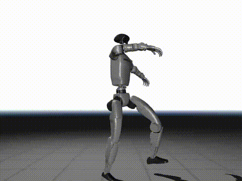  
**78 before**

</td>
<td align="center" width="50%">

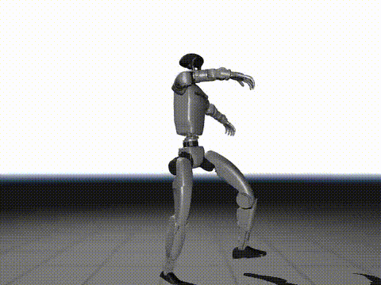  
**78 after**

</td>
</tr>
</table>

<table>
<tr>
<td align="center" width="50%">

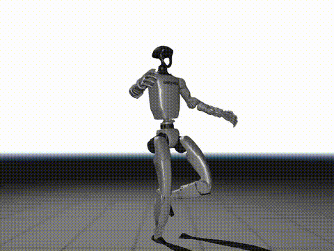  
**117 before**

</td>
<td align="center" width="50%">

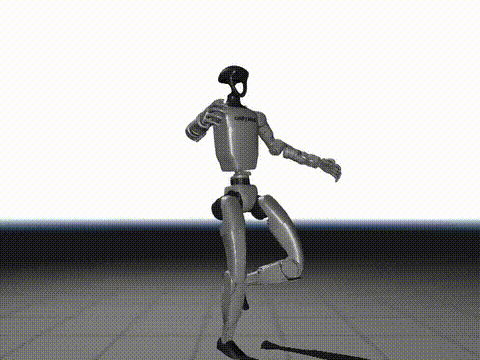  
**117 after**

</td>
</tr>
</table>

<table>
<tr>
<td align="center" width="50%">

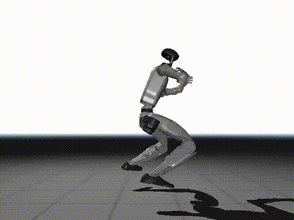  
**213 before**

</td>
<td align="center" width="50%">

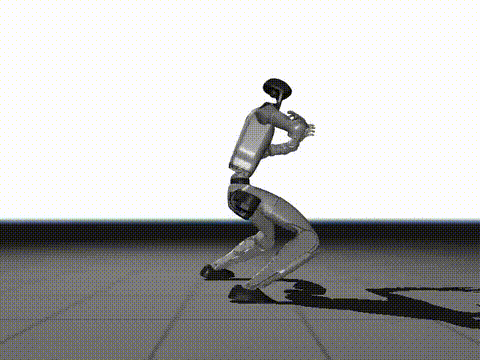  
**213 after**

</td>
</tr>
</table>

<table>
<tr>
<td align="center" width="50%">

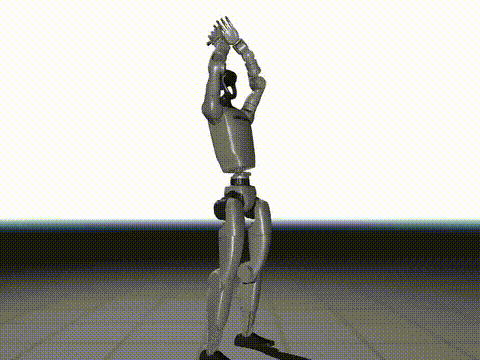  
**278 before**

</td>
<td align="center" width="50%">

  
**278 after**

</td>
</tr>
</table>


## Video Source and Acknowledgement

<table>
<tr>
<td width="180" valign="top">

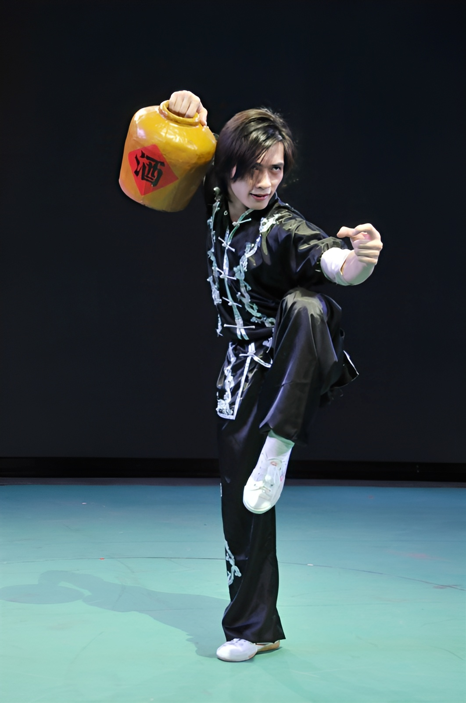

</td>
<td valign="top">

<p>
<strong>Xie Yuanhang</strong> is an athlete of the <strong>Guangxi Wushu Team</strong>,
a <strong>National-Level Elite Athlete of China</strong>, and holds the rank of
<strong>Chinese Wushu 6th Duan</strong>. He achieved <strong>third place in the Wushu Taolu event
at the 10th National Games of the People’s Republic of China</strong>.
His video content systematically covers a wide range of
<strong>International Wushu Competition Taolu</strong>, including Changquan, Nanquan,
weapon routines, and Taijiquan (including Taijijian).
</p>

<p>
We would like to express our <strong>special and sincere gratitude to Xie Yuanhang</strong>
for granting permission to use his video materials for
<strong>research and academic purposes</strong>.
</p>

<p>
🔗 <strong>Personal Homepage (Bilibili):</strong><br>
<a href="https://space.bilibili.com/1475395086">
https://space.bilibili.com/1475395086
</a>
</p>

<p>
本项目所使用的视频素材主要来源于谢远航教练/运动员在其个人平台公开发布的系列武术训练与竞赛示范视频。谢远航系广西武术队运动员，国家级运动健将，中国武术六段，并曾获得中华人民共和国第十届运动会武术套路项目第三名。其视频内容系统覆盖国际武术竞赛套路中的长拳、南拳、器械及太极拳（剑）等多个项目，动作规范、节奏清晰，具有较高的专业性与示范价值。
</p>

<p>
在此，我们特别鸣谢谢远航先生对本项目的大力支持与授权，允许我们基于其公开视频素材进行整理、处理与研究使用。本数据集仅用于科研与学术目的。
</p>

</td>
</tr>
</table>

## Acknowledgement

This project builds upon the following excellent open-source projects:

* [GVHMR](https://github.com/zju3dv/GVHMR): 3D human mesh recovery from video
* [GMR](https://github.com/YanjieZe/GMR): general motion retargeting framework
* [Holosoma](https://github.com/amazon-far/holosoma): full-stack humanoid simulation and reinforcement learning framework

We gratefully acknowledge these projects, upon which this dataset and training pipeline are built. GVHMR recovers 3D human motion directly in a gravity-aligned reference frame, enabling physically consistent motion reconstruction from raw training videos. GMR is used for motion reorientation and normalization. Holosoma is a comprehensive humanoid robotics framework for training and deploying reinforcement learning policies on humanoid robots, as well as motion retargeting. Without these open-source projects, large-scale processing of in-the-wild martial arts videos and the open release of this dataset would not have been feasible.  


## License

This project depends on third-party library with its own licenses:


Please review this licenses before use.

## Citation

If you use this project in your research, please consider citing:

```bibtex
@article{lei2026kungfuathletebot,
  author  = {Zhongxiang Lei and Lulu Cao and Xuyang Wang and Tianyi Qian and Jinyan Liu and Xuesong Li},
  title   = {A Kung Fu Athlete Bot That Can Do It All Day: Highly Dynamic, Balance-Challenging Motion Dataset and Autonomous Fall-Resilient Tracking},
  year    = {2026},
  eprint  = {2602.13656},
  archivePrefix = {arXiv},
  primaryClass  = {cs.RO}
}
