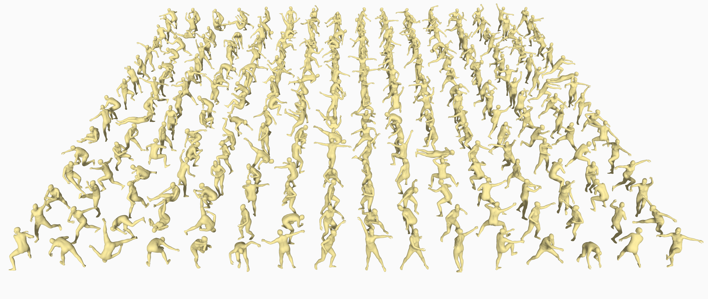
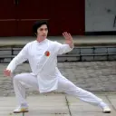

# KungfuAthlete

</img>
## Video Source and Acknowledgement



The video materials used in this project are primarily sourced from a series of publicly released martial arts training and competition demonstration videos by **Xie Yuanhang**.

**Xie Yuanhang** is an athlete of the **Guangxi Wushu Team**, a **National-Level Elite Athlete of China**, and holds the rank of **Chinese Wushu 6th Duan**. He achieved **third place in the Wushu Taolu event at the 10th National Games of the People’s Republic of China**. His video content systematically covers a wide range of **International Wushu Competition Taolu**, including Changquan, Nanquan, weapon routines, and Taijiquan (including Taijijian). The demonstrations are technically precise, rhythmically clear, and of high professional and instructional value.

We would like to express our **special and sincere gratitude to Xie Yuanhang** for his strong support and for **granting permission to use his video materials** in this project. Under this authorization, the dataset is **constructed and processed based on his publicly available videos**, and is intended **solely for research and academic purposes**. His generous support has been instrumental in ensuring the high quality and reliability of this dataset.

🔗 **Personal Homepage (Bilibili):**  
https://space.bilibili.com/1475395086

本项目所使用的视频素材主要来源于 谢远航 教练/运动员在其个人平台公开发布的系列武术训练与竞赛示范视频。谢远航系广西武术队运动员，国家级运动健将，中国武术六段，并曾获得中华人民共和国第十届运动会武术套路项目第三名。其视频内容系统覆盖国际武术竞赛套路中的长拳、南拳、器械及太极拳（剑）等多个项目，动作规范、节奏清晰，具有较高的专业性与示范价值。

在此，我们特别鸣谢谢远航先生对本项目的大力支持与授权，允许我们基于其公开视频素材进行整理、处理与研究使用。本数据集即在上述授权前提下，基于其公开视频内容构建与制作，相关使用仅用于科研与学术目的。谢远航先生的无私支持为本数据集的高质量构建提供了重要保障，在此谨致以诚挚感谢。


## Demo
<table>
<tr>
<td align="center" width="50%">
<video src="./docs/example_gvhmr_278.mp4" width="400" controls></video>
<br><b>GVHMR</b>
</td>
<td align="center" width="50%">
<video src="./docs/example_g1_after_278.mp4" width="400" controls></video>
<br><b>GMR (after root height adjusted)</b>
</td>
</tr>
</table>

## Pipeline

KungfuAthlete's data pipeline: Kungfu Video → Human Pose Extraction → Robot Motion Conversion → Data Cleaning

```
[Video] → GVHMR → [GVHMR-Pred] → GMR → [Robot Motion] → Cleaning → [KungfuAthlete]
```

## Data Format

### GVHMR pred

```python
# gvhmr_pred.pt
{
  "smpl_params_global":
  {
    "body_pose": torch.Tensor,    # (N, 63)
    "betas": torch.Tensor,    # (N, 10)
    "global_orient": torch.Tensor,    # (N, 3)
    "transl": torch.Tensor,    # (N, 3)
  }
  "smpl_params_incam":
  ...
}
```

### GMR qpos

```python
# robot_qpos.npz
{
  "fps": array(30),
  "qpos": np.ndarray,    # (N, 36) 36 = 3(position xyz) + 4(quaternion wxyz) + 29(DOF)
}
```

## Download

You can obtain the KungfuAthlete dataset through **[this link](https://drive.google.com/drive/folders/1ZntW9jPA-BXxttvCWlKQsSbmXt91fSsh?usp=sharing)** and use it directly for your robot training. We provide GVHMR pred data and pre-cleaned **g1** robot qpos data. 

The KungfuAthlete dataset is constructed from publicly available high-dynamic videos on the , which undergo GVHMR action extraction, GMR retargeting, and data cleaning. The KungfuAthlete dataset is divided into two types: **Ground** and **Jump**. Ground indicates that there will always be one foot on the ground during the entire motion, while Jump indicates that both feet are off the ground during motion. 

The following content includes visualizations of GVHMR and GMR data, as well as examples of how we use height adjustment algorithms to process the qpos data. If you wish to apply this dataset to other robots, you can refer to our processing pipeline.

## Project Structure

```
src/
├── demo/                         # Data demo files 
│   ├── gvhmr/                             # Pose data (gvhmr-pred .pt)
│   │   ├── ground/                        # One foot always on the ground data
│   │   └── jump/                          # Data containing jumping actions
│   └── g1/                                # g1 data (robot qpos .npz)
│       ├── ground/                        # One foot always on the ground data
│       └── jump/                          # Data containing jumping actions
│
├── scripts/                               # KungfuAthlete scripts
│   ├── vis_gvhmr.py                       # Vis gvhmr data
│   ├── adjust_robot_height_by_gravity.py  # Newly added GMR script
│   ├── vis_robot_qpos.py                  # Newly added GMR script
│   └── gvhmr_to_qpos.py                   # Newly added GMR script
│
├── ./docs/                                  # Document files
│
└── third_party/                           # External dependencies (submodules)
    └── GMR/                               # Motion retargeting
```

## Installation

This project requires **two conda environments**: `vis-gvhmr` and `gmr`.

```bash
# Clone repo (with submodules)
git clone --recursive waitingforgitlink
cd KungfuAthlete

# Or initialize submodules after cloning
git submodule update --init --recursive
```

### 1. GMR Environment (Robot Retargeting)

```bash
conda create -n gmr python=3.10 -y
conda activate gmr
cd third_party/GMR
pip install -e .
cd ./..
```

For details, see [GMR README](third_party/GMR/README.md).

### 2. Vis-GVHMR Environment (Pose Visualization)

```bash
conda create -n vis-gvhmr python=3.9 -y
conda activate vis-gvhmr
pip install -r requirements.txt
```

### 3. Add new GMR scripts

To use GMR-retargeted data for training, we have added scripts to GMR that adapt the data to training program required qpos format.

```bash
cp retarget/scripts/gvhmr_to_qpos.py ./third_party/GMR/scripts/
cp retarget/scripts/vis_robot_qpos.py ./third_party/GMR/scripts/
cp retarget/scripts/adjust_robot_height_by_gravity.py ./third_party/GMR/scripts/
```
## Usage

> **Note**: Our **height adjustment algorithm** only applies to **qpos data** that is retargeted to **jump** type data, and **ground** type data does not require height adjustment after retargeting.

> **Note**: The GVHMR visualization script and the GMR project rely on different environments. Please ensure that you are in the correct file directory and conda environment (`gmr` or `vis-gvhmr`) when executing different tasks.

### Ground data

```bash
# Visualize GVHMR data (conda env: vis-gvhmr, directory: KungfuAthlete/)
conda activate vis-gvhmr
python scripts/vis_gvhmr.py --pose_file ./KungfuAthlete/gvhmr/ground/3/3.pt --save_path ./KungfuAthlete/gvhmr/ground/3/3.mp4

# Retarget to robot motion (conda env: gmr, directory: KungfuAthlete/third_party/GMR/)
conda activate gmr
cd third_party/GMR/
python scripts/gvhmr_to_qpos.py --gvhmr_pred_file=././KungfuAthlete/gvhmr/ground/3/3.pt --save_path=././KungfuAthlete/g1/ground/3/3.npz --record_video --video_path=././KungfuAthlete/g1/ground/3/3.mp4

# Visualize GMR data (conda env: gmr, directory: KungfuAthlete/third_party/GMR/)
conda activate gmr
python scripts/vis_robot_qpos.py --robot_motion_path=././KungfuAthlete/g1/ground/3/3.npz --record_video --video_path=././KungfuAthlete/g1/ground/3/3.mp4
```

### Jump data

```bash
# Visualize GVHMR data (conda env: vis-gvhmr, directory: KungfuAthlete/)
conda activate vis-gvhmr
python scripts/vis_gvhmr.py --pose_file ./KungfuAthlete/gvhmr/jump/278/278.pt --save_path ./KungfuAthlete/gvhmr/jump/278/278.mp4

# Retarget to robot motion (conda env: gmr, directory: KungfuAthlete/third_party/GMR/)
conda activate gmr
cd third_party/GMR/
python scripts/gvhmr_to_qpos.py --gvhmr_pred_file=././KungfuAthlete/gvhmr/jump/278/278.pt --save_path=././KungfuAthlete/g1/jump/278/278_before.npz --record_video --video_path=././KungfuAthlete/g1/jump/278/278_before.mp4

# Adjust height (conda env: gmr, directory: KungfuAthlete/third_party/GMR/)
conda activate gmr
python scripts/adjust_robot_height_by_gravity.py --robot_motion_path=././KungfuAthlete/g1/jump/278/278_before.npz --save_path=././KungfuAthlete/g1/jump/278/278_after.npz --record_video --video_path=././KungfuAthlete/g1/jump/278/278_after.mp4

# Visualize GMR data (conda env: gmr, directory: KungfuAthlete/third_party/GMR/)
conda activate gmr
python scripts/vis_robot_qpos.py --robot_motion_path=././KungfuAthlete/g1/jump/278/278_after.npz --record_video --video_path=././KungfuAthlete/g1/jump/278/278_vis.mp4
```

## The Height-Adjusted Examples
<table>
<tr>
<td align="center" width="50%">
<video src="./docs/example_g1_before_78.mp4" width="400" controls></video>
<br><b>78 before</b>
</td>
<td align="center" width="50%">
<video src="./docs/example_g1_after_78.mp4" width="400" controls></video>
<br><b>78 after</b>
</td>
</tr>
</table>
<table>
<tr>
<td align="center" width="50%">
<video src="./docs/example_g1_before_117.mp4" width="400" controls></video>
<br><b>117 before</b>
</td>
<td align="center" width="50%">
<video src="./docs/example_g1_after_117.mp4" width="400" controls></video>
<br><b>117 after</b>
</td>
</tr>
</table>
<table>
<tr>
<td align="center" width="50%">
<video src="./docs/example_g1_before_213.mp4" width="400" controls></video>
<br><b>213 before</b>
</td>
<td align="center" width="50%">
<video src="./docs/example_g1_after_213.mp4" width="400" controls></video>
<br><b>213 after</b>
</td>
</tr>
</table>
<table>
<tr>
<td align="center" width="50%">
<video src="./docs/example_g1_before_278.mp4" width="400" controls></video>
<br><b>278 before</b>
</td>
<td align="center" width="50%">
<video src="./docs/example_g1_after_278.mp4" width="400" controls></video>
<br><b>278 after</b>
</td>
</tr>
</table>

## Supported Robots

| Robot | ID | DOF |
|-------|-----|-----|
| Unitree G1 | `unitree_g1` | 29 |
| Unitree H1 | `unitree_h1` | 19 |
| Booster T1 | `booster_t1` | 23 |

See [GMR README](third_party/GMR/README.md) for full list

<!-- ## TODO

- [ ] **`Git` (Create Git)** - Create git code repository

- [ ] **`GMR` (Add submodule)** - Add GMR as submodule after create git code repository

  ```
  git submodule add https://github.com/taeyoun811/GMR.git third_party
  ```

- [ ] **`Data` (Add link)** - Add Data download link

- [ ] **`License` (Add license)** - Confirm the license for adding new code and ensure compliance with the licenses for using other open source projects. -->

## Acknowledgements

This project builds upon the following excellent open source projects:

- [GVHMR](https://github.com/zju3dv/GVHMR): 3D human mesh recovery from video
- [GMR](https://github.com/YanjieZe/GMR): general motion retargeting framework

## License

This project depends on third-party library with its own licenses:


Please review this licenses before use.